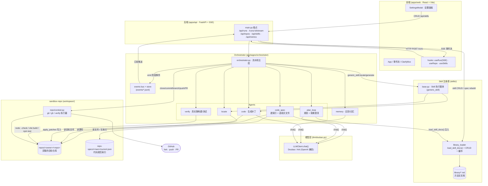
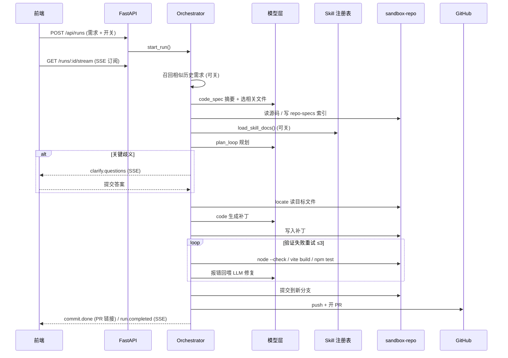

# Architecture

Super Individual 把 PM 的自然语言需求转成目标仓库的可提测 PR。下面是各层与调用关系。

## 总览图

## 各层职责

| 层 | 位置 | 职责 |
|---|---|---|
| **前端** | `apps/web` | React + Vite。提交需求、实时看事件流(SSE)、回答澄清、管理目标仓库与 skill(设置面板)。Vite 把 `/api` 代理到后端 3001。 |
| **后端** | `apps/api/app/main.py` | FastAPI。HTTP 端点 + SSE 流;把请求转交 Orchestrator,把事件总线推给前端;skill 的增删改查直接落到 `library_loader`。 |
| **Orchestrator** | `packages/orchestrator/orchestrator.py` | 流水线主控:按阶段串起各 agent,发阶段事件,管召回与记忆。 |
| **模型层** | `llm/doubao.py` | `LLMClient.chat()`,Doubao/Ark 的 OpenAI 兼容封装。被 code_spec / plan_loop / code / memory 调用;计 token 与成本。 |
| **Skill 注册表** | `skills/` | `library/*.md` 是做各类需求的方法论文档;`library_loader` 负责加载(带缓存)+CRUD;`base.py` 的 `generic_skill` 是 locate/generate 的执行载体(规划本身已交给 plan_loop)。 |
| **sandbox-repo** | `workspace/` | 克隆下来的目标仓库(`repos/`)、其代码规范索引(`repo-specs/`),以及对它做 git/gh/验证操作的 `conduit.py`。所有代码改动只发生在这里。 |

## 一次 run 的调用时序

## 关键调用关系（一句话版）

- **前端 ↔ 后端**:请求走 HTTP `POST /api/runs`,进度走 SSE `GET /api/runs/:id/stream`;设置面板的 skill 增删改走 `/api/skills`。
- **后端 → Orchestrator**:`main.py` 调 `start_run()` 起流水线;事件总线(`events bus`)反向推回 SSE。
- **Orchestrator → 模型层**:code_spec / plan_loop / code / memory 通过 `LLMClient.chat()` 调 Doubao。
- **plan_loop ← Skill 注册表**:规划阶段 `load_skill_docs()` 把方法论文档注入提示词(可被前端 skill 开关跳过)。设置面板的 CRUD 经 `library_loader` 改 `.md` 并清缓存,下一次 run 即时生效。
- **Orchestrator/Agents → sandbox-repo**:code_spec 读源码并写规范索引,locate 读目标文件,code 写补丁,verify 在仓库里真实跑构建与测试;`conduit.py` 负责 clone/commit/branch/push,并用 `gh` fork 与开 PR。
